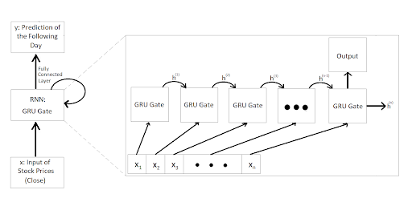
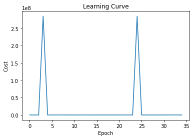
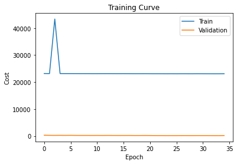

# CSC413 Final Project

## Introduction
The volatile and unpredictable nature of the stock market makes it particularly difficult
for any sort of prediction or pattern recognition task. However, this is exactly the challenge
that we would like to undertake by building a Recurrent Neural Network model which can take in a sequence of closing prices for a certain stock from 2016-01-04 to 2017-11-09 and make a prediction for the closing price of the stock on the date 2017-11-10 (dates correspond to the latest data available in the dataset used for our project). The input to the recurrent neural network are arrays of varying length of these closing prices, since each company has varying amounts of data available within the date range (for example, there is a possibility that the particular company went public on the stock exchange after the data listed above or that data for certain dates are missing). The output is a singular scalar value that denotes the network's prediction for the closing price on 2017-11-11.

## Model Figure 

## Model Parameters
Our model has 4 parameters, namely input_size, hidden_size, num_layers, and output_size. The input_size represents the number of expected features in our input vector. In our task, input_size=1 because we are only using the closing feature for our predictions. The hidden_size is the number of units in each hidden state and is a hyperparameter that can be tuned. In our task, hidden_size=128. The num_layers represent the number of recurrent layers in our model. For example, setting num_layers=2 means stacking two GRUs together such that we create a stacked GRU, where the second GRU takes in outputs from the first GRU to generate a prediction. In our task, num_layers=1 because we have been working with single-layer GRUs in this course. Finally, output_size represents the size of the output vector which is our prediction. In our task, output_size=1 because we are predicting the stock closing price for the next day, given a sequence of arbitrary length, where the length represents the number of previous days.

## Model Examples 
**Successful One:** 
Position of input sequence in the Test Set: 526\
Ground Truth Label of input sequence: 3.91\
Model Prediction of input sequence: 3.9494571685791016\
Difference between True Value and Model Prediction: 0.03945716857910142

**Unsuccessful One:**
Position Number of  input sequence in Test Set: 126\
Ground Truth Label of input sequence: 887.87\
Model Prediction of input sequence: 109.58541107177734\
Difference between True Value and Model Prediction: 778.2845889282227

## Data Source
Our data was sourced from a publicly available dataset found on Kaggle.

See: https://www.kaggle.com/datasets/borismarjanovic/price-volume-data-for-all-us-stocks-etfs
This data consists of “all historical daily price and volume data for all US-based stocks and ETFs* trading on the NYSE, NASDAQ, and NYSE MKT”. It consists of over 8,000 .txt files, each of which represents the full price history of a US-based stock up to 2017.

According to the acknowledgement by the curator of this data set we “may do with it as [we] wish”.
*An ETF is, for all intents and purposes, a collection of stocks that are invested in together.
We use the phrase “stock” to mean either a stock or an ETF.

## Data Summary
Each line of each file represents the value of that stock on a particular day, summarised as follows:

**Date :** The date which that particular line of data is from\
**Open :** The price of the stock is valued at, at the daily open, 9:30 am ET\
**High :** The highest price that the stock was valued at during the day\
**Low :** The lowest price that the stock was valued at during the day\
**Close :** The price that the stock was valued at the closing of the trading day, 4:00pm ET\
**Volume :** The total number unique shares of the stock that were traded during the day\
**OpenInt :** From what we can tell this is “The Open Interest”. We actually can’t tell what this is, but across all files it is constant 0, so we are just going to ignore it.

Since each stock has been publicly traded for different lengths of time, the length of each file is different. In some cases, the stock has been public for only a few months, and has less than 100 lines of data. In other cases the stock has
been public for several decades and has several thousand lines of data.

Here is an excerpt from the file “aapl.us.txt” which represents the price history of Apple Inc.\
Date,Open,High,Low,Close,Volume,OpenInt\
1984-09-07,0.42388,0.42902,0.41874,0.42388,23220030,0\
1984-09-10,0.42388,0.42516,0.41366,0.42134,18022532,0

## Data Transformation
In order to focus our training on the most recent data, we only looked at data from January 1st, 2016 to November 10th, 2017 (the date of our most recent data).

We define a data sequence as the sequence of closing values of the stock of a particular company on each day up to November 9th, 2017. We use that data from November 10th, 2017 as the target value of our sequence. We chose closing prices as the feature we want for our model as it widely considered within the stock trading world to be the “most accurate valuation of a stock or other security until trading resumes on the next trading day” (from: https://www.investopedia.com/terms/c/closingprice.asp)

We have 8,507 such data sequences total in our data set. As a group, with discussions from our TA, we decided that having 10,000 data sequences in total is more acceptable. In order to generate the 1500 more sequences, we introduced "Gaussian Noise" (in our case, random values sampled from a gaussian distribution) to 1500 existing data sequences picked randomly (using the same seed described below), and added them to the training set.  

## Data Split
To split the data, we used a  60% training, 20% validation, 20% testing split. We used a seed of 31415926 to generate an arbitrary permutation of the indexes and then partitioned the data based on that. From this we have 5,105 data sequences in the training set, and 1,701 data sequences in both the validation and testing set.

Notice that we are splitting the data up by company as each data sequence described above corresponds to stock closing prices for a particular company. This was an intentional choice as we wanted our model to be able to generalise well to US stock market trends, and not be tied down to data pertaining to individual companies. Another split idea proposed was to parse each of the companies and perform the data split for each individual company (data from every company is in the training, validation, and test set this way). However, we decided against this for the reasons described earlier.

## Training Curve 
We will be using the training curve from the third training run of our model. This is because after observing the plots for the learning curve, training loss and validation loss, we noticed that they looked roughly the same across each run. However, for the third training run, we noticed that the values for training loss were lower compared to the values obtained in the other runs. Also, the learning curve loss was slowly decreasing as well for this run. We believe this is due to the lower learning rate and removal of weight decay, as changing these values led to less fluctuations in our plots. Below are the resultant plots for the learning curve, training and validation curve.

## Hyperparameter Tuning 
We trained our model using six different sets of hyperparameters. Assume that 
model = StockPredictGRU() is called before every call to training.

**First Training Run**\
We will start with a batch size of 300 because the default value of 128 is less compared to the number of datapoints we have (6605), so our plots may have a lot of noise and we want to avoid this. We will also run for 40 epochs and keep the default values for our weight_decay and learning_rate for now to see what loss is being generated. 

train_loader = StockBatcher(train, batch_size=300, drop_last=False)
valid_loader = StockBatcher(valid, batch_size=300, drop_last=False)
 
train_rnn_network(model, train_loader, valid_loader, weight_decay=0.0, learning_rate=0.1, num_epochs=40). The resultant plots are, 

The final five values for the learning curve loss are 562.390991; 4448.698242, 877.532471, 781.620728, 151420.562500. The final five values for the training curve loss are 38556.550057, 38610.214685, 38602.280872, 38550.211950,  38617.118164. Lets try increasing the weight decay and decreasing the learning rate. 

**Second Training Run**\
train_loader = StockBatcher(train, batch_size=300, drop_last=False)
valid_loader = StockBatcher(valid, batch_size=300, drop_last=False)
 
train_rnn_network(model, train_loader, valid_loader, weight_decay=0.01, learning_rate=0.01, num_epochs=40). The resultant plots are,

The final five loss values are 205.152161, 52.720432, 95.500214, 170.549133, 391.289093. The final five training costs are 76832.615981, 76819.604463, 76814.843674, 76868.370351, 76860.09528. The learning curve loss fluctuates but is much lower compared to the values obtained in the first run. The training cost is much higher. Lets try increasing the batch size, removing the weight decay and decreasing the number of epochs to see if the training loss decreases and the fluctuations in the learning curves reduce.

**Third Training Run**\
train_loader = StockBatcher(train, batch_size=500, drop_last=False)
valid_loader = StockBatcher(valid, batch_size=500, drop_last=False)

train_rnn_network(model, train_loader, valid_loader, weight_decay=0.0, learning_rate=0.01, num_epochs=35). The resultant plots for the learning and training curves looks like this, 

The final five values for the learning curve loss are 68.401688, 2917.834473, 91832.281250, 24.985926, 645.217468. The final five values for the training cost are 23100.059411, 23094.408892,  23089.378082,  23109.042306. The training loss is consistent and much lower compared to the first run, and the loss seems to fluctuate but decrease. If we were to increase the number of epochs to 40, we are inferring that the fluctuation might decrease and the loss will be consistent and lower.
 
Let’s try reducing the learning rate even further to see if the smaller updates help. We’ll continue with 0 weight decay, and use 30 epochs.
 
**Fourth training run**\
train_loader = StockBatcher(train, batch_size=500, drop_last=False)
valid_loader = StockBatcher(valid, batch_size=500, drop_last=False)
 
train_rnn_network(model3, train_loader, valid_loader, weight_decay=0, learning_rate=0.001, num_epochs=30). The resultant plots for the learning and training curves looks like this, 
 

The final five values for the learning curve loss are 1.362639, 300.884796, 0.519497, 0.260414, 1.251674. The final five values for the training cost are 29921.169572, 29914.667754,  29911.407681,  29909.558584, 29907.429824. 

Next we’ll try and use a very small weight decay, along with this small learning rate, to see if they can produce better results.

**Fifth training run**\
train_loader = StockBatcher(train, batch_size=500, drop_last=False)
valid_loader = StockBatcher(valid, batch_size=500, drop_last=False)

train_rnn_network(model3, train_loader, valid_loader, weight_decay=5*(10**(-3)), learning_rate=0.001, num_epochs=30). The resultant plots for the learning and training curves looks like this,

The final five values for the learning curve loss are 252110896.000000, 3272.985107, 34613.980469, 0.056904, 580.347534. The final five values for the training cost are 49598.491862, 29912.300642,  29914.273150,  29908.7642104, 29909.844177. 

Finally, we will try and reduce the weight decay to an even smaller amount.

**Sixth training run**\
train_loader = StockBatcher(train, batch_size=500, drop_last=False)
valid_loader = StockBatcher(valid, batch_size=500, drop_last=False)

train_rnn_network(model3, train_loader, valid_loader, weight_decay=5*(10**(-4)), learning_rate=0.001, num_epochs=30) The resultant plots for the learning and training curves looks like this,

The final five values for the learning curve loss are 0.668878, 15.802783, 137.756210, 0.160565, 0.477753. The final five values for the training cost are 29918.913680, 29915.452643,  29910.529355,  49583.860974, 29906.194459. 

## Quantitative Measures 
Due to the nature of our problem, using a strict equality of prediction and label is unreasonable since getting an exact value as a prediction with no variance every time is highly unlikely. To combat this, we came to the conclusion that using loss as the measure for our model’s performance made the most sense. More specifically using Mean-Squared Loss, this will not penalize our model for getting a prediction slightly incorrect – Low loss values indicate good performance, and high loss values indicate worse performance. When using the test set on our model we will be measuring its performance with average loss (cost), this way we will get a single value to represent how the model performed against data it has never seen before. 

## Justification of Results
We used our trained model from the third training run to make predictions for the test set. This is because we observed smaller values for training loss in this run compared to the other five runs and less fluctuations in our resultant plots. We believe the less fluctuations and the consistent, decreasing loss is due to the smaller learning rate used for this run. To visualise our predictions, we use the following plots to display the labels (ground truth values for the closing feature) of our test set (blue curve) compared to the predictions we have made for the closing feature using our model (orange curve).\ 

However, it is difficult to observe the trend of the predictions using the plot above, so we will analyse smaller portions of the plot to view the curve easily. Below is the plot of the predictions and ground truth values for the first 170 sequences in our test test. 

We can see in the circled areas above that the predictions, although not exactly the same as the correct values, differ from the ground truth slightly and still follow the same trend of test set labels. This idea is further observed if we consider the plots of the next 170 sequences until the end of our test set. 

Since each plot contains a few hundred predictions that follow the trend of the correct labels, this allows us to conclude that our model works reasonably well. It is also important to keep in mind that the nature of stocks is unpredictable, thus, we are not expecting to see a high level of accuracy. There are instances where the data spikes, and this proves to be a challenge for our model as it shows that it is unable to make such drastic predictions. However the model does still predict that there is an increase in value wherever the data spikes, it just has trouble identifying the magnitude of the increase. Since these spikes are happening at "random" points we will consider them as outliers due to them being almost impossible to predict based on prior data. As stated in the quantitative analysis, data encoding sentiment analysis and news about the company is required for our model to perform better. We also have to consider that we are feeding in varied stock data from many different industries into our model, each of which have their own underlying market trends. From the plots, it is clear that the model is having trouble picking up any patterns and this could be due to the overload of data from different industries being fed to the model. Therefore, considering all of this, for us to achieve a fair level of similarity between the ground truth and predictions tells us that our model behaves in an acceptable way. 

## Qualitative Results
Above, we see several graphs that plot the model predictions in comparison with the ground truth values. We can see the model is able to somewhat identify some of the trends prevalent within the data, but is unable to fully identify the underlying trends. This should not come as a surprise, as it has been proven that a big factor that impacts the fluctuations of stock prices is the news related to the company and market sentiment (the psychology of market participants). As a recent example, consider the Elon Musk situation. The tweets that he puts out have a significant impact on the price of Tesla stock. Since the data we are working with does not encode this kind of information, it is difficult for the model to be able to pick up on any patterns.  If given a chance to re-do this assignment, we would most likely work in some kind of sentiment analysis corresponding to news articles related to the companies in our dataset, and feed this information into our model as well. Overall, there are a number of other factors that impact stock prices (inflation, economic strength, etc.) which our model did not have access to that led to its somewhat random performance. (from: https://www.investopedia.com/articles/basics/04/100804.asp)

## Quantitative Results
In general, the results of our model are fairly random. As training went on the training loss alternated between very large values and very small values with no discernible trend. For example, during the training of our fourth set of hyper parameters, the reported training loss for epochs 8 through 12 were, 6304.453125, 0.223532, 1.421142, 887.299927, 0.002169. This is seemingly reflected in the plotted learning and training curves of all of our training attempts. The learning and costs remained nearly constant, aside from a few large spikes that returned to the original near constant values shortly after. This is reflected in the final results of our model after training. We see that the predictions have managed to learn the general range in which most stock prices lie, but whether or not the prediction is reasonably close to the actual value is seemingly completely random. It also can’t predict with any degree of accuracy for stocks which appear to be major outliers. These stocks are the very large jumps in ground truth that occur through the data. When faced with these the model still makes predictions that are in the general range that most stocks lie. 

## Ethical Consideration
The use of this model impacts those who take part in trading within the stock market, in particular they could use it in-order to detect potential rises or dips in prices of any stock they wish. The model benefits those who are looking to hold shares for a short term or even long term as it could potentially let you know if a stock is worth investing in or if it's worth selling. Another group of people who could make use of such a model would be business owners as they could use the model as another statistical provider in any financial decisions. People who make use of this model would have a clear advantage over those who do not within the stock market as having the ability to analyze trends and make a decent prediction would be an invaluable asset. Some misuses could be if a person decides to sell a large number of shares of a specific company due to the model telling them that it predicts a dip in price soon – this will affect the value of the stocks since now there are more available to be bought, prices will dip even more. Basically, misuses could relate to users making extreme decisions based on the predictions – buying a lot of stocks for a company due to a prediction of prices increasing in the future or selling due to a prediction of prices falling. This hurts the companies who are part of the stock market as the value of their company could decrease at any moment if the model makes a certain prediction. 

## Authors

**Maadhav Adit Krishnan**:

- Contributed to architecture plans for model 
- Contributed to data collection, data analysis, and data transformation process (implemented init_data function) 
- Implemented data augmentation process 
- Implemented “stock batcher” process 
- Wrote training code for model 
- Responsible for “Qualitative Results” and “Introduction” portion of README 
- Contributed to “Data” related results from README 

**Jonathan McLaren Martin**:

- Contributed to data collection, analysis and transformation 
- Contributed to early data exploration 
- Contributed to training and tuning of hyper parameters 
- Contributed to Stock Batcher portion of code 
- Wrote the data source, data summary, data transformation, and data split sections of the README. 
- Wrote the  “Quantitative Results” section of the README. 
- Contributed to the hyper parameter training section of the README

**Maham Khan**:

In the code, I
- Contributed to model design and creation
- Contributed to training
- Created a function ‘get_testcost’ to plot the predictions vs the ground truth labels for our test set, and generated several plots to analyse trends
- Contributed to finding correct and incorrect predictions from the model

In the README, I worked on the following sections
- The Model Parameters
- Contributed to Model Examples
- Training Curve Explanation
- Contributed to Hyperparameter Tuning
- Contributed to Justification of Results

 **Abhirag Rajan Nair** :

Model Implementation: 
- Contributed in the model design and its creation
- Implemented the forward function
- Contributed in implementations of the training and cost functions
- Contributed in the creating the “Prediction vs Ground Truth” plots 
   - Finding correct and incorrect predictions

README File:
- Model Figure
- Quantitative Measures 
- Contributed in Model Examples
- Ethical Implications 
- Contributed in Justification of Results 

